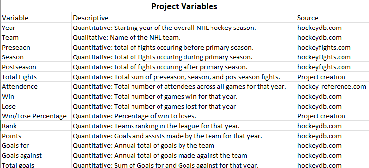
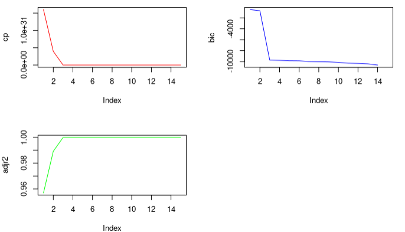
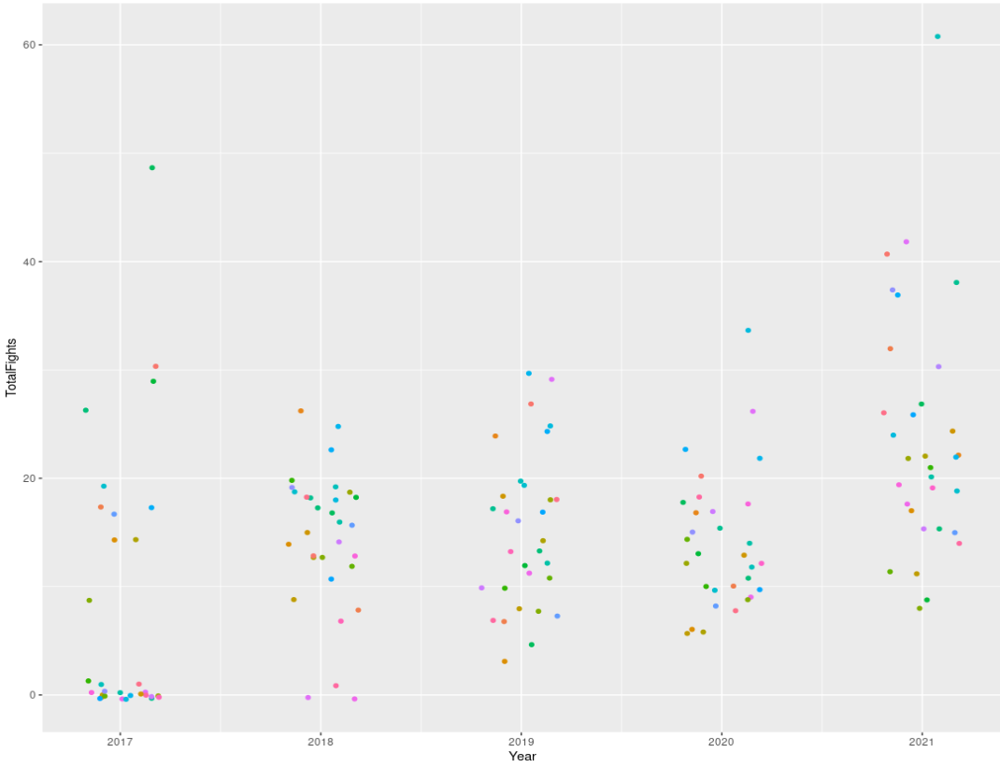

## Introduction 

The motivation for this project is based upon an interest in exploring the relationship in the National Hockey League between fighting during professional hockey games and the monetary fines placed on fights. 

Fighting during hockey has a long tradition, going back to when the NHL was formed in 1917 (Pro and Con: Fighting in Hockey, 2021). The current definition of a fight in the NHL rule book is "as at least one player punching or taking a swing at another player repeatedly, or players wrestling in a way that is difficult to break up" (Pro and Con: Fighting in Hockey, 2021). Players who fight are sent to the penalty box and are subject to fines.

Comedian Rodney Dangerfield is credited with saying, "I went to a fight the other night, and a hockey game broke out," which was an accurate portrayal in the 1980s when 100% of NHL games, on average, had at least one fight (Pro and Con: Fighting in Hockey, 2021). The occurrence of a fight in every game was a dramatic increase from the 1960s, when fights occurred in only 20% of games. In an effort to reduce the number of fights in hockey games, the NHL introduced an instigator rule in 1992, which penalized the individual starting the fight with an additional two-minute penalty (Pro and Con: Fighting in Hockey, 2021).
  
The concern over fighting in NHL is closely tied to long-term health effects for players who engage in fights. "Concussions are more common in hockey than in most other sports. A preliminary Boston University study published...found people were at 23% greater risk of developing the degenerative neurological condition chronic traumatic encephalopathy (CTE) for every additional year they played hockey" (Saul, 2022). With the project's narrative foundation comprised of its motivation and the problem it wants to address, the building and exploration of the methodology of how it will approach the problem can begin.
  
## Methodology

As mentioned in the previous section, this project sought to understand the relationship between fights and fines to determine if the introduction of said fines significantly impacted the number of fights annually. In doing so, establish a means of predicting the occurrence of fights. After initial web inquiries into determining the monetary value of the fine issued to players for fighting, it became clear that the NHL does not levy fines against players who fight during a game. "While the players don't typically get fined, in the NHL if a player is assessed an instigator penalty in the last five minutes of regulation, or during overtime, the player's Coach is fined $10,000" (Brave Stick Hockey). Out of concern that there were no solid metrics for determining if the relationship was statistically significant, the group broadened the scope of the project to determine what, if any, hockey statistics played a role in influencing fight outcomes. It is at this point that inquiries into possible datasets began. The group ultimately decided to build the dataset as no one source had all the data required to meet the project's approach. 

The data to construct the dataset came from three sources, with the selected variables manually collected into a single CSV format file. The three sources provide the best selection for the project. However, due to a lack of data available for specific years and limitations on time, the dataset was defined to include only data from 2017-2021. Due to incomplete fight data for years prior to 2017, the number of entries in the data set narrows down to 157 entries (n = 157). Each entry represents the number of fights each team had evaluated per year. Additional variables present in each entry would include audience attendance, wins, loses, win/lose ratio, total points awarded to the team for goals and assists, the team's rank for the year, goals for the team, goals against the team, and total goals for the year. For a further breakdown of the variables, with a brief description and data origin, used in this project, please see the Project Variables table below. Lastly, for perspective's sake, the NHL has 1,312 games per regular season, played by 32 teams, with each team playing 82 games. With a dataset in place, the focus can shift from the design phase of the project's methodology to the implementation phase. 
 

 
Initial exploration of the dataset and potential relationship between the response variable of Totalfights and all other variables as predictors began with simple numerical model construction, such as linear regression. Afterward, implementing a linear regression prediction with the linear model. A collocation map and single variable plots that include but are not limited to years, win/lose ratio, and goals, against the response variable provided graphical insights into the possible relationships. After initial exploration, the dataset was split into an 80/20 training-to-testing ratio to maintain proper model accuracy. Splitting the data into subsets reduces bias and allows for drawing conclusions with greater confidence. Completing the initial exploration phase, the group sought to create greater depth in the model's construction. The techniques discussed in the course were implemented to define the prediction model further. The process started with cross-validation, something that would find continued usage throughout the rest of the methodology. The process continued with ridge and lasso regression to identify the ideal subset of variables for the model. Step forward and back was used further to validate the results of the ridge and lasso regressions. At thispoint, the group elevated the potential of the mode to predict. 

## Result and Discussion 

Unfortunately, after simple statistical processing and analysis, the selected variables are not statistically significant in helping determine fights breaking out at NHL games. That is not to say that all variables were insignificant but given their usage to generate the response variable, the correlation is insignificant—examination of the correlation map with consideration of Totalfights highlights this assertion of insignificance. Analyzing the results from the ridge regression, one can see that three variables appear to be the ideal number for model construction. This result makes sense, given that three statistically significant variables were identified in the basic linear model. However, as previously mentioned, those preseason, season, and postseason variables were used to calculate the response variable. We should discard these insights as they do not do much to make an accurate prediction. 

 
Even though the variable selection was adverse to defining a model that can provide accurate predictions, the project did yield some interesting insights. During 2020, the country was in the throws of a global pandemic. Surprisingly, the NHL continued with games during this time but with zero attendance by fans. The choice to have zero attendance would likely impact fights. However, upon examining a plot of years against fights, one can easily see that attendance could have been a worthwhile contributor to fights, but alas, the fights that year trend with fights of years before and after it. 

## Conclusion 

When discussing a data science project's uneventful narrative, there is often a sense of failure in not getting statistically significant results. However, in a rush to publish and produce worthwhile results, such a narrative can be a reminder that statistically insignificant is also essential. During the project, the group had the opportunity to explore an exciting topic, construct a dataset, and implement Rmarkdown statistical machine learning techniques taught through the course. If time had allowed, the project would have liked to explore developing a more robust dataset with additional variables, such as other violations or penalties. Additionally, exploration of the relationship between Year and Totalfights might yield statistical insights or the development of a new approach to the problem of addressing fights in hockey games. More time to implement course-specific models and techniques would also have been beneficial.. 

## Reference 
Brave Stick Hockey. Do hockey players get fined for fighting? (NHL rules) - BS hockey. Brave Stick Hockey. (2022, June 1). Retrieved December 14, 2022, from https://bshockey.com/do-hockey-players-get-fined-for-fighting/ 

Hockey fight statistics. Hockey Fights. (n.d.). Retrieved December 2, 2022, from https://www.hockeyfights.com/stats 

Hockey statistics and history for the NHL and more! hockey DB. (n.d.). From https://www.hockeydb.com/ 

NHL stats, history, scores, standings, playoffs, Schedule & Records. Hockey. (n.d.). From https://www.hockey-reference.com/ 

Pro and Con: Fighting in Hockey. (March 9, 2021). Retrieved December 12, 2022, from https://www.britannica.com/story/pro-and-con-fighting-in-hockey#:~:text=Allowing%20fighting%20makes \ %20the%20sport,an%20unwritten%20code%20among%20players.

Saul, Derek. "NHL Fights Linked To Further Violence, Study Finds." Forbes.com (June 22, 2022) Retrieved December 12, 2022, from https://www.forbes.com/sites/dereksaul/2022/06/22/nhl-fights-linked-to-further-violence-study-finds/?sh=2151b9a858b6

