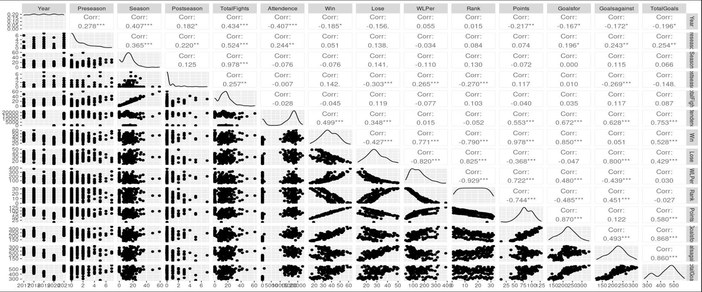
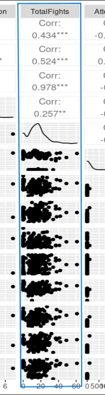
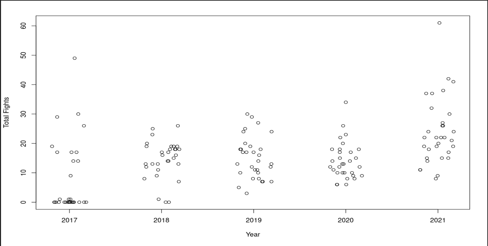

```{r setup, include=FALSE}
knitr::opts_chunk$set(echo = TRUE)
```

# Introduction

## Motivation

  The motivation for this project is based upon an interest in exploring the relationship in the National Hockey League between fighting during professional hockey games and the monetary fines placed on fights. 
  
  Fighting during hockey has a long tradition, going back all the way to when the NHL was formed in 1917 (Pro and Con: Fighting in Hockey, 2021). The current definition of a fight in the NHL rule book describes it "as at least one player punching or taking a swing at another player repeatedly, or players wrestling in a way that is difficult to break up" (Pro and Con: Fighting in Hockey, 2021). Players who fight are sent to the penalty box and are subject to fines.
  
  Comedian Rodney Dangerfield is credited with saying “I went to a fight the other night, and a hockey game broke out,” which was an accurate portrayal in the 1980's when 100% of NHL games, on average, had at least one fight (Pro and Con: Fighting in Hockey, 2021). This is a dramatic increase from the 1960's when only 20% of games had a fight. In an effort to reduce the number of fights in hockey games, the NHL introduced an instigator rule in 1992, which penalized the individual starting the fight with an additional two minute penalty (Pro and Con: Fighting in Hockey, 2021).
  
  The concern over fighting in NHL is closely tied to long-term health effects of the fight. "Concussions are more common in hockey than in most other sports. A preliminary Boston University study published...found people were at 23% greater risk of developing the degenerative neurological condition chronic traumatic encephalopathy (CTE) for every additional year they played hockey" (Saul, 2022).

# Data

  Compiling useful data required pulling data from several sites, including fight data from hockeyfights.com, and general hockey statistics from hockeydb.com and hockey-reference.com. The data was further refined to include only 2017-2021, due to the available data for other years being incomplete. The initial data set included over 2000 entries and was further refined to 156 entries. Each entry represents the number of fights each team had per year evaluated. The NHL has 1,312 games per regular season, played by 32 teams, with each team playing 82 games.

## Variables Evaluated

The vast amount of variables evaluated was narrowed down to the following for further inspection:

* Total fights
* Years
* Teams
* Goals (for, against, total)
* Season (pre, regular, and post)
* Attendance
* Win, Loss, and Win/loss percentage
* Overall NHL ranking per season
* Points (combination of goals and assists)


## Correlation map




## Zoom in of Correlation Map 



# Application of DSCI 445 Concepts

Utilized:
<br>

* ggplot
* lm
* splitting dataset to train and test
* Ridge regressions
* adjusted R-squared
* BIC
* Cross Validation!

# Challenges with Data

* Readily available or consolidated data, had to combine multiple sources to form dataset
* Several teams were created during the time frame, creating incomplete information
* Utilized omit.na code to compensate
* pre-fight, post-fight, and in-season fighting
* availability of more information on the specifics of the fight (time in the game, type, number of people in the fight, instigator versus respondent of the fight, etc).

# Findings

* It could appear that none of the variables are statically significant, with the exception of the fights subcategories, which makes sense Totalfights is based on them. 

* Surprisingly, Montreal Canadians, during the initial look, appeared to be statistically significant, yet in more robust analysis, it was not. 

* Year/TotalFights: Interesting to see that in 2020 there was no physical attendance due to COVID restrictions; fights still occurred and in somewhat in line with other years.

# Plots of Interest



# Future Work

* Explore additional variables and develop or acquire a more robust dataset to perhaps look at different violations and the impact of the fines on fighting. 

* More time to further evaluate the data.


# References

Hockey fight statistics. Hockey Fights. (n.d.). Retrieved December 2, 2022, from https://www.hockeyfights.com/stats 

Hockey statistics and history for the NHL and more! hockey DB. (n.d.). From https://www.hockeydb.com/ 

NHL stats, history, scores, standings, playoffs, Schedule &amp; Records. Hockey. (n.d.). From https://www.hockey-reference.com/ 

Pro and Con: Fighting in Hockey. (March 9, 2021). Retrieved December 12, 2022, from https://www.britannica.com/story/pro-and-con-fighting-in-hockey#:~:text=Allowing%20fighting%20makes%20the%20sport,an%20unwritten%20code%20among%20players.

Saul, Derek. "NHL Fights Linked To Further Violence, Study Finds." Forbes.com (June 22, 2022) Retrieved December 12, 2022, from https://www.forbes.com/sites/dereksaul/2022/06/22/nhl-fights-linked-to-further-violence-study-finds/?sh=2151b9a858b6
