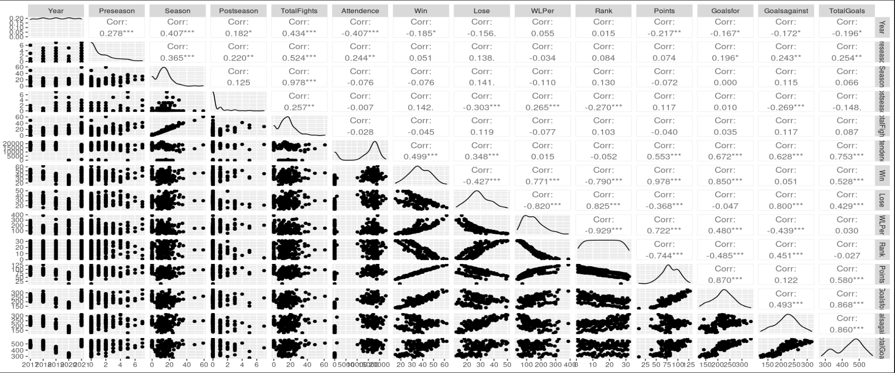

```{r setup, include=FALSE}
knitr::opts_chunk$set(echo = FALSE)
```

## Ever Go to a Boxing Match and a Hockey Game Breaks Out? 
Or an Exploration into the Incidence of Fights in Professional Hockey Games.

<br>

  Chien Lin
<br>

  Jason Nero
<br>

  Sarah Sublett

<br>

DSCI 445 - Group 1
<br>

5 December 2022

## Motivation

* General interest in the impact of fines imposed by the NHL to curb fighting during professional hockey games. 
* Fighting at the professional level encourages similar behavior in junior leagues, and fighting can lead to serious injuries.

## Data

* Utilizing fight data from hockeyfights.com and NHL.com
* Refined fight data to years 2017-2021 due to incomplete data 
* Initial data set included over 2000 entries and was refined to 156 entries 
* Each entry represents the number of fights each team had per year evaluated
* 32 teams in the NHL
* 1,312 games per regular season, with each team playing 82 games

## Variables Evaluated

* Total fights
* Years
* Teams
* Goals (for, against, total)
* Season (pre, regular, and post)
* Attendance
* Win, Loss, and Win/loss percentage
* Overall NHL ranking per season
* Points (combination of goals and assists)

## Correlation map




## Zoom in of Correlation Map 


## Application of DSCI 445 Concepts

Utilized:
<br>

* ggplot
* lm
* splitting dataset to train and test
* Ridge regressions
* adjusted R-squared
* BIC
* Cross Validation!

## Challenges with Data

* Readily available or consolidated data, had to combine multiple sources to form dataset
* Several teams were created during the time frame, creating incomplete information
* Utilized omit.na code to compensate
* pre-fight, post-fight, and in-season fighting
* availability of more information on the specifics of the fight (time in the game, type, number of people in the fight, instigator versus respondent of the fight, etc).

## Findings

* It could appear that none of the variables are statically significant, with the exception of the fights subcategories, which makes sense Totalfights is based on them. 

* Surprisingly, Montreal Canadians, during the initial look, appeared to be statistically significant, yet in more robust analysis, it was not. 

* Year/TotalFights: Interesting to see that in 2020 there was no physical attendance due to COVID restrictions; fights still occurred and in somewhat in line with other years.

## Plots of Interest


## Future Work

* Explore additional variables and develop or acquire a more robust dataset to perhaps look at different violations and the impact of the fines on fighting. 

* More time to further evaluate the data.

## References
Hockey fight statistics. Hockey Fights. (n.d.). Retrieved December 2, 2022, from https://www.hockeyfights.com/stats 

Hockey statistics and history for the NHL and more! hockey DB. (n.d.). From https://www.hockeydb.com/ 

NHL stats, history, scores, standings, playoffs, Schedule &amp; Records. Hockey. (n.d.). From https://www.hockey-reference.com/ 
